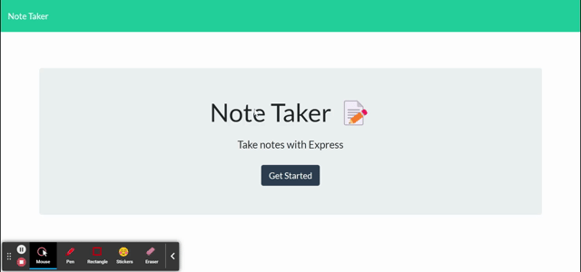

# Note Taker
  

  ## Description
  A note taker app that can be used to write and save notes. This applications uses Express.js for the back end and will save and retrieve note data from a JSON file.
  ## Table of Contents  
  * [Usage](#usage)  
  * [License](#license) 
  * [Questions](#questions) 
  ## Usage
  [Go to app hosted at Heroku](https://walker-note-taker.herokuapp.com)  

      
  ## License
  The license for this project is MIT. 
  ## Questions
  My Github Profile: [michaelwwalker42](https://github.com/michaelwwalker42)  
  For additional questions email me at michaelwwalker42@gmail.com  

